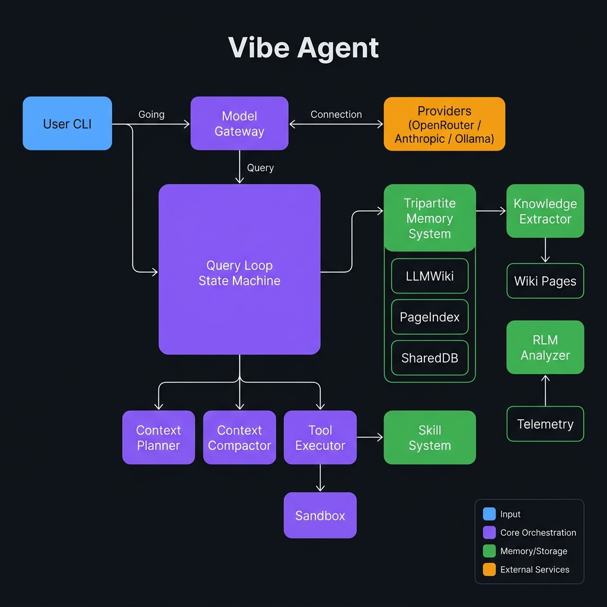

# Vibe Agent

Vibe Agent is an open, visual-first interactive CLI agent harness. It is designed to provide a robust, resilient, and secure environment for LLM-based autonomous tasks, independent of any specific model or provider.

## 🚀 Key Features

-   **Multi-Provider Fallback**: Seamlessly switch between OpenAI, Anthropic, and other providers (via OpenRouter or Ollama) when primary models fail.
-   **Secure Tool Execution**: Sandboxed Bash and File system tools with three-layer security defense and path jailing.
-   **Context Management**: Automated compaction and summarization to handle long-running conversations within token limits.
-   **Eval-Driven Development**: A built-in suite of 50+ evaluation cases to ensure every update maintains performance and stability.
-   **Phase 2 Skill System**: Native vibe skill format with TOML frontmatter, markdown body, validation, security scanning, and atomic installation.
-   **Tripartite Memory System**: Automated async knowledge extraction, FlashLLM contradiction detection, and telemetry-triggered RLM analysis.
-   **Secret Redaction**: Automatic stripping of API keys (OpenAI, AWS, GitHub, etc.) and passwords from trace stores and logs.
-   **Interactive CLI**: Readline support with persistent history, token metrics display, and rich skill/wiki management commands.

---

## 🏗️ System Architecture



The system is built on a modular **Harness** pattern. The **Query Loop State Machine** is the central orchestrator that connects the **Model Gateway** (for multi-provider LLM access), the **Tool Executor** (for secure sandboxed actions), and the **Tripartite Memory System** (for long-term knowledge persistence).

```
User CLI
  │
  ▼
Query Loop State Machine (IDLE → PLANNING → TOOL_EXECUTION → SYNTHESIZING → COMPLETED)
  ├── Model Gateway ──► Providers (OpenRouter / Anthropic / Ollama)
  ├── Context Planner / Compactor
  ├── Tool Executor ──► Bash & File (Jailed Sandbox)
  │                ──► Skill System
  └── Tripartite Memory System
       ├── LLMWiki + PageIndex + SharedDB (SQLite)
       ├── Knowledge Extractor (async background)
       └── RLM Threshold Analyzer (telemetry-triggered)
```

Read more in the [Architecture Document](docs/ARCHITECTURE.md).

---

## ⚙️ Configuration

Vibe Agent is configured via `~/.vibe/config.yaml`. It supports defining multiple **Providers** (endpoints) and **Models** (logic names mapped to providers).

```yaml
providers:
  openrouter:
    base_url: "https://openrouter.ai/api/v1"
    adapter: "openai"
    api_key_env_var: "OPENROUTER_API_KEY"

models:
  primary:
    provider: "openrouter"
    model_id: "google/gemini-2.0-flash-001"

fallback:
  enabled: true
  chain: ["primary", "backup-model"]
```

See the [Configuration Guide](docs/CONFIGURATION.md) for full details on setting up providers, multi-model fallback, and the tripartite memory system.

---

## 🛠️ How to Run

### Prerequisites

- Python 3.11+
- An LLM provider (local Ollama, OpenRouter, Anthropic, etc.) — see [Configuration Guide](docs/CONFIGURATION.md)

### 1. Install

```bash
# Clone and install in editable mode (includes all dev extras)
git clone https://github.com/your-org/vibe-agent.git
cd vibe-agent
pip install -e ".[dev]"
```

### 2. Configure your LLM provider

```bash
# Copy the example config and edit it with your provider settings
cp docs/sample_config.yaml ~/.vibe/config.yaml
$EDITOR ~/.vibe/config.yaml
```

For a quick local setup with **Ollama** (no API key needed):

```bash
# Pull a model
ollama pull qwen3:8b

# Point Vibe at it
cat > ~/.vibe/config.yaml << 'EOF'
llm:
  default_model: "local"
  base_url: "http://localhost:11434"
  timeout: 120.0

models:
  local:
    provider: "ollama"
    model_id: "qwen3:8b"
EOF
```

### 3. Start the agent

```bash
# Interactive chat session
python -m vibe

# One-shot query
python -m vibe "Explain the difference between a mutex and a semaphore"

# With a specific model
python -m vibe --model qwen3:8b "What is the 52-week high of QQQ?"

# With debug logging
python -m vibe --debug
```

---

## 📈 Example: QQQ Stock Analysis

Vibe Agent can be used as a general-purpose reasoning engine for tasks like financial data analysis. Below is an end-to-end example using the included `qqq_price.py` helper.

**1. Ask the agent to analyze QQQ directly:**

```bash
python -m vibe "Fetch the latest QQQ price, calculate its RSI(14) and MA(250), \
  and tell me if it is currently above or below its 200-day moving average."
```

**2. Run the included standalone QQQ price fetcher:**

```bash
# Requires: pip install yfinance
python qqq_price.py
```

Example output:
```
📊 QQQ Latest Data:
   Date: 2026-04-25 00:00:00-04:00
   Open:   $446.12
   High:   $452.80
   Low:    $443.91
   Close:  $450.67
   Volume: 42,871,200
```

**3. Full multi-ticker technical analysis (TSLA, MSFT, GOOGL, AMZN, NVDA):**

```bash
python stocks_analysis.py
```

This generates `stocks_analysis.png` with Price + MA250, RSI(14), and MACD charts for each ticker, and prints a summary table:

```
Ticker |      Close |      MA250 |    RSI |       MACD |     Signal
-----------------------------------------------------------------
TSLA   |    $245.67 |    $260.43 |  43.21 |      -3.45 |      -2.10
MSFT   |    $415.20 |    $392.88 |  58.70 |       4.12 |       3.80
...
```

**4. Teach the agent to remember your investment preferences using the Wiki:**

```bash
# After a conversation about QQQ strategy, check what Vibe extracted:
vibe memory status

# View extracted wiki pages
vibe memory wiki list --tag investing

# Search for related knowledge
vibe memory wiki search "QQQ moving average"
```

---

## 🧩 Skill System

Vibe Agent includes a native skill format designed for safe, portable, and versioned automation:

### SKILL.md Format
Skills are defined as markdown files with TOML frontmatter:

```markdown
+++
vibe_skill_version = "2.0.0"
id = "stock-analysis"
name = "Stock Analysis"
description = "Fetch and analyze stock technicals using yfinance"
category = "finance"
tags = ["stocks", "analysis", "finance"]

[trigger]
patterns = ["analyze stock", "check price of"]
required_tools = ["bash"]

[[steps]]
id = "fetch"
description = "Fetch and analyze ticker data"
tool = "bash"
command = "python qqq_price.py"

[steps.verification]
exit_code = 0
+++

# Stock Analysis Skill

## Overview
Fetches stock price data and computes basic technical indicators.
```

### Skill CLI Commands

```bash
# Scaffold a new skill
vibe skill create my-skill

# Validate a skill directory
vibe skill validate ./my-skill

# Install from git, tarball, or local path
vibe skill install https://github.com/user/skill-repo.git
vibe skill install ./my-skill

# List installed skills
vibe skill list

# Run a skill with variables
vibe skill run stock-analysis ticker="QQQ"

# Uninstall a skill
vibe skill uninstall my-skill
```

### Key Components

| Component | Description |
|-----------|-------------|
| `Skill` Models | Pydantic models with validation for ID format, unique step IDs, and required fields |
| `SkillParser` | Parses TOML frontmatter + markdown body into structured `Skill` objects |
| `SkillValidator` | Security scanning for filesystem traversal, phishing URLs, and dangerous script patterns |
| `ApprovalGate` | Protocol supporting CLI interactive approval, `AutoApprove`, and `AutoReject` modes |
| `SkillInstaller` | Atomic installation from git clone, tarball download, or local path with rollback support |
| `SkillExecutor` | Variable substitution, BashTool delegation, and step-by-step verification |

---

## 🧠 Memory Commands

```bash
# Show tripartite memory system status
vibe memory status

# List all wiki pages (filter by tag or status)
vibe memory wiki list
vibe memory wiki list --tag investing --status verified

# Search the wiki (BM25 full-text search)
vibe memory wiki search "QQQ moving average"

# Show a specific page
vibe memory wiki show <page-id-or-slug>

# Expire old draft pages
vibe memory wiki expire --days 30

# Rebuild the routing index
vibe memory wiki index rebuild
```

---

## 🔬 Running Evaluations

```bash
# Run the built-in eval suite (50+ cases)
vibe eval run

# Filter by subsystem tag
vibe eval run --tag subsystem=memory

# Run a soak test
vibe eval soak --duration 30 --cpm 6

# Update the performance baseline
vibe eval update-baseline
```

---

## 📚 Documentation Index

-   [Architecture](docs/ARCHITECTURE.md)
-   [Configuration Guide](docs/CONFIGURATION.md)
-   [Roadmap & Plans](docs/ROADMAP.md)
-   [Evaluation Suite](docs/EVALUATION.md)
-   [Changelog](docs/CHANGELOG.md)

---

*Vibe Agent is currently in Phase 2e (Tripartite Memory System). See the [Roadmap](docs/ROADMAP.md) for what's next. Test suite: **899 tests passing**.*
