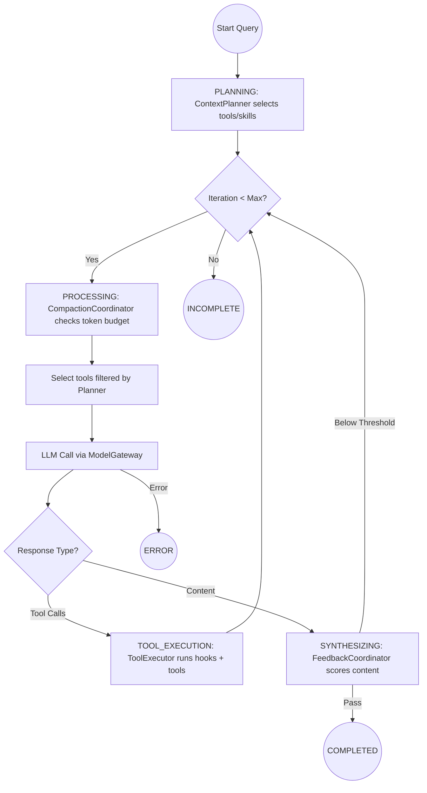

# Vibe Agent Architecture Wiki

Vibe Agent is a high-performance, resilient, and secure agent harness. Unlike many agent frameworks that focus on the model, Vibe Agent treats the **harness** as the primary product—ensuring that the LLM is managed with rigorous error recovery, safety constraints, and automated evaluation.

---

## 1. System Philosophy

*   **Model Agnosticism**: The system is designed to hop between models and providers (OpenAI, Anthropic, Ollama, OpenRouter) seamlessly.
*   **Zero-Trust Tools**: All tools (Bash, File) are "jailed" and subjected to multi-layer validation before execution.
*   **Stability over Speed**: Built-in circuit breakers and exponential backoff ensure the agent remains stable even when remote APIs are flailing.
*   **Empirical Progress**: Every architectural change must be validated against the `vibe eval` suite.

---

## 2. System Overview

### 2.1 Overall Architecture Diagram
```
┌─────────────────────────────────────────────────────────┐
│                    User Interface (CLI)                 │
└────────────────────────────┬────────────────────────────┘
                             │
                             ▼
┌─────────────────────────────────────────────────────────┐
│                      Query Loop                         │
│   (State Machine, Context Compactor, Hook Pipeline)     │
└──────────────┬─────────────┬─────────────┬──────────────┘
               │             │             │
               ▼             ▼             ▼
┌───────────────────┐ ┌─────────────┐ ┌───────────────────┐
│   Model Gateway   │ │ Tool System │ │ Instruction Set   │
│ (Multi-Provider,  │ │ (Bash, File,│ │ (Skills, AGENTS)  │
│  Fallback, CB)    │ │  MCP Bridge)│ │                   │
└───────────────────┘ └─────────────┘ └───────────────────┘
```

---

## 3. Query Loop Flow

The `QueryLoop` is a state-machine-driven async generator that manages the agent's "thought-action" cycle.

### 3.1 Loop Flowchart


---

## 4. Token Efficiency Design

Efficient token usage is a core design goal of Vibe Agent, implemented through three primary layers:

### 4.1 Context Planning (Pre-filtering)
Unlike basic agents that send every tool schema to the LLM on every turn, Vibe Agent uses a **Context Planner**.
- **Impact**: By selecting only the relevant tools and skills for a specific user query, it significantly reduces the "System Prompt Bloat," saving thousands of tokens per turn in complex environments.

### 4.2 Automated Context Compaction
The `CompactionCoordinator` monitors the token usage before every single LLM call.
- **Dynamic Summarization**: When the limit is reached, it doesn't just "cut off" history. It uses a `SummarizeStrategy` to condense early conversation into a semantic core, preserving intent while freeing up budget.
- **Message Jailing**: Individual tool results or large file reads are capped at a `max_chars_per_msg` limit to prevent a single "noisy" tool from consuming the entire context window.

### 4.3 Feedback Loops (Turn Reduction)
The `FeedbackCoordinator` acts as a quality gate.
- **Impact**: By catching malformed or low-quality responses locally (via the `FeedbackEngine`) and providing specific fix hints, it prevents the agent from entering "hallucination loops" or making unnecessary tool calls that waste tokens and time.

---

## 5. Component Deep Dive

### 5.1 Model Gateway (`vibe/core/model_gateway.py`)
The gateway is the "resilience layer" for all LLM communication.
*   **Adapters**: Supports `OpenAIAdapter` and `AnthropicAdapter`.
*   **Registry-Aware Resolution**: Dynamically resolve `base_url`, `api_key`, and `adapter` for every fallback attempt.
*   **Circuit Breaker**: Tracks failures per model. If a model fails 5 times consecutively, the breaker "opens" (cooldown: 60s).

### 5.2 Coordinators (`vibe/core/coordinators.py`)
Responsibilities are delegated to specialized submodules:
1.  **ToolExecutor**: Manages tool execution, `HookPipeline` (PRE/POST constraints), and MCP fallback.
2.  **FeedbackCoordinator**: Manages self-verification and retry hints.
3.  **CompactionCoordinator**: Triggers `ContextCompactor` logic.

### 5.3 Tool System & Security (`vibe/tools/`)
*   **Bash Sandbox**: Uses `subprocess_exec` + regex denylist (e.g., blocking `sudo`).
*   **File Jail**: `_resolve_and_jail()` prevents path traversal even via symlinks.

---

## 6. Configuration & Quality

*   **Hierarchical Config**: Default → `config.yaml` → Environment Variables (`VIBE_*`).
*   **Evaluation Suite**: 30+ built-in cases in `vibe/evals/builtin/`.
*   **Scorecards**: JSON performance reports generated per model run.

---

*Last Updated: 2026-04-19 (v0.2.0-alpha)*
