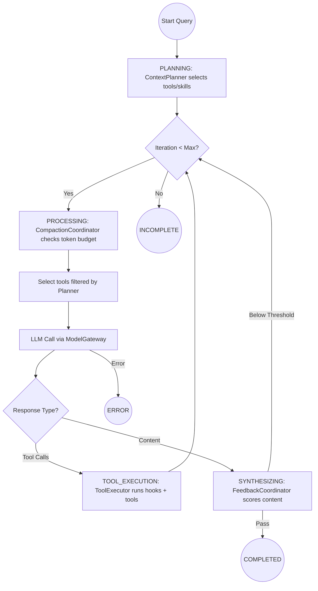

# Vibe Agent Architecture Wiki

Vibe Agent is a high-performance, resilient, and secure agent harness. Unlike many agent frameworks that focus on the model, Vibe Agent treats the **harness** as the primary product—ensuring that the LLM is managed with rigorous error recovery, safety constraints, and automated evaluation.

---

## 1. System Philosophy

*   **Model Agnosticism**: Hop between models and providers (OpenAI, Anthropic, Ollama, OpenRouter, Kimi) seamlessly via adapter-based gateway.
*   **Zero-Trust Tools**: All tools (Bash, File) are "jailed" and subjected to multi-layer validation before execution.
*   **Stability over Speed**: Built-in circuit breakers, exponential backoff, and provider fallback ensure the agent remains stable even when remote APIs are flailing.
*   **Empirical Progress**: Every architectural change must be validated against the `vibe eval` suite. 30+ built-in evals, multi-model scorecards, and soak tests.

---

## 2. System Overview

### 2.1 Overall Architecture Diagram

```
┌─────────────────────────────────────────────────────────────────────────┐
│                    User Interface (CLI)                                 │
│    (Typer + Rich, interactive mode with readline history)               │
└────────────────────────────┬────────────────────────────────────────────┘
                             │
                             ▼
┌─────────────────────────────────────────────────────────────────────────┐
│                      Query Loop                                         │
│   (State Machine, Context Compactor, Hook Pipeline, Planners)           │
└──────────────┬─────────────┬─────────────┬────────────────┬─────────────┘
               │             │             │                │
               ▼             ▼             ▼                ▼
┌───────────────────┐ ┌─────────────┐ ┌────────────────┐ ┌───────────────┐
│   Model Gateway   │ │ Tool System │ │ Instruction Set│ │   Memory      │
│ (Multi-Provider,  │ │ (Bash, File,│ │ (Skills,       │ │ (TraceStore,  │
│  Fallback, CB)    │ │  MCP Bridge)│ │  AGENTS.md)    │ │  Wiki, Eval)  │
└───────────────────┘ └─────────────┘ └────────────────┘ └───────────────┘
```

---

## 3. Query Loop Flow

The `QueryLoop` is a state-machine-driven async generator (`vibe/core/query_loop.py`, ~370 lines) that manages the agent's "thought-action" cycle.

### 3.1 States

```python
class QueryState(Enum):
    IDLE = auto()
    PLANNING = auto()
    PROCESSING = auto()
    TOOL_EXECUTION = auto()
    SYNTHESIZING = auto()
    COMPLETED = auto()
    INCOMPLETE = auto()   # max_iterations exhausted
    STOPPED = auto()      # user interrupted
    ERROR = auto()
```

### 3.2 Loop Flowchart



### 3.3 Key Behaviors

- **Planning:** `ContextPlanner` uses keyword/substring scoring against tool names, descriptions, skill metadata, and MCP configs. If no match, falls back to returning **all tools** (current limitation — hybrid semantic planner planned).
- **Compaction:** Triggered before every LLM call if estimated tokens exceed threshold. Four strategies: `TRUNCATE` (default), `LLM_SUMMARIZE`, `OFFLOAD`, `DROP`.
- **Feedback:** `FeedbackCoordinator` evaluates content responses via `FeedbackEngine`. Score below threshold (default 0.7) → inject retry hint and continue loop. Currently silently returns `score=0.5` on any exception (planned fix).
- **Iteration limit:** `max_iterations` (default 50) with `INCOMPLETE` state on exhaustion.

---

## 4. Token Efficiency Design

Efficient token usage is a core design goal, implemented through three primary layers:

### 4.1 Context Planning (Pre-filtering)
`ContextPlanner` (`vibe/harness/planner.py`) selects relevant tools/skills/MCPs before the LLM call.
- **Current:** Keyword/substring scoring with "return all tools" fallback.
- **Target:** Hybrid tiered planner (keyword fast-path → embedding fallback → LLM router).

### 4.2 Automated Context Compaction
`CompactionCoordinator` (`vibe/core/coordinators.py`) monitors token usage before every LLM call.
- **Strategies:** `TRUNCATE` (default), `LLM_SUMMARIZE`, `OFFLOAD`, `DROP`.
- **Current default:** Placeholder summary (`[Context summarized: N messages omitted]`). Real LLM summarization planned.
- **Estimation:** Uses `tiktoken` (cl100k_base) when available; falls back to chars/4.
- **Message capping:** Individual tool results capped at `max_chars_per_msg` (default 4000).

### 4.3 Feedback Loops (Turn Reduction)
`FeedbackCoordinator` acts as a quality gate.
- Catches malformed or low-quality responses locally via `FeedbackEngine`.
- Provides specific fix hints to prevent hallucination loops.
- **Current limitation:** Silent degradation on exceptions masks real failures.

---

## 5. Component Deep Dive

### 5.1 Model Gateway (`vibe/core/model_gateway.py`)
The gateway is the "resilience layer" for all LLM communication.
*   **Adapters:** Supports `OpenAIAdapter` and `AnthropicAdapter` via adapter registry.
*   **Registry-Aware Resolution:** `ProviderRegistry` dynamically resolves `base_url`, `api_key`, `adapter`, and `extra_headers` per provider.
*   **Circuit Breaker:** Per-model state. Opens after `threshold` consecutive failures (default 5), cooldown 60s.
*   **Fallback Chain:** Configurable model chain with `auto_fallback`. Rate limits (429) do NOT trigger fallback.
*   **Structured Output:** `structured_output()` method forces JSON schema compliance with markdown cleanup.
*   **Debug Mode:** Redacted header logging to stderr.

### 5.2 Coordinators (`vibe/core/coordinators.py`)
Responsibilities extracted from `QueryLoop` for testability:
1.  **ToolExecutor**: Manages tool execution, `HookPipeline` (PRE/POST constraints), and MCP fallback. Sequential execution with exception isolation per tool call.
2.  **FeedbackCoordinator**: Manages self-verification and retry hints. Threshold-based with max retry cap.
3.  **CompactionCoordinator**: Triggers `ContextCompactor` logic before LLM calls.

### 5.3 Tool System & Security (`vibe/tools/`)
*   **Bash Sandbox:** Uses `subprocess_exec` (no shell) + regex denylist (`sudo`, `rm -rf /`, etc.).
*   **File Jail:** `_resolve_and_jail()` prevents path traversal even via symlinks.
*   **Hook Pipeline:** 5 stages (`PRE_VALIDATE → PRE_MODIFY → PRE_ALLOW → POST_EXECUTE → POST_FIX`).
*   **Current limitation:** Only 2 built-in hooks with ~4 patterns. 5-layer defense expansion planned.

### 5.4 Skill System v2 (`vibe/harness/skills/`)
Native skill format with TOML frontmatter (`+++` delimited):
*   **Parser:** `SkillParser` parses TOML frontmatter + markdown body.
*   **Models:** Pydantic v2 validation for IDs, unique step IDs, safe formats.
*   **Validator:** Security scanning (fs destruction, pipe-to-shell, eval injection, suspicious URLs, hardcoded credentials).
*   **ApprovalGate:** Protocol with `CLIApprovalGate`, `AutoApproveGate`, `AutoRejectGate`.
*   **Installer:** Atomic installation from git, tarball (zip-slip protection), or local path.
*   **Executor:** Step execution with variable substitution and verification.
*   **Current limitation:** Naive string `.replace()` for variable substitution (planned fix).

### 5.5 Memory (`vibe/harness/memory/`)
*   **TraceStore:** SQLite with `sessions`, `messages`, `tool_calls`, `session_embeddings`. Optional vector search via `sentence-transformers` with keyword fallback.
*   **EvalStore:** SQLite with `evals` and `eval_results`. Schema migration support.
*   **Wiki:** Simple markdown read/write in `~/.vibe/wiki/`. Compilation from traces planned.

---

## 6. Eval Infrastructure (`vibe/evals/`)

### 6.1 Components
*   **EvalRunner** (`runner.py`): Core execution engine. Currently reuses `QueryLoop` instance (factory-per-case fix planned).
*   **MultiModelRunner** (`multi_model_runner.py`): Runs suite against multiple models, produces `Scorecard` with per-tag breakdowns. Correctly creates fresh `QueryLoop` per model.
*   **SoakTestRunner** (`soak_test.py`): Long-running stress tests with degradation detection (first 20% vs last 20% latencies). Correctly creates fresh `QueryLoop` per case.
*   **Observability** (`observability.py`): OpenTelemetry-style spans, counters, gauges, histograms. Export to JSON.

### 6.2 Assertion Types (11)
`file_exists`, `file_contains` + `contains_text`, `stdout_contains`, `response_contains`, `response_contains_any`, `min_response_length`, `tool_called`, `tool_sequence`, `no_tool_called`, `context_truncated`, `metrics_threshold`.

---

## 7. Configuration & Quality

*   **Hierarchical Config:** Default → `~/.vibe/config.yaml` → Environment Variables (`VIBE_*`).
*   **Security Config:** `approval_mode` (manual/smart/auto), file safety, env sanitization, sandbox backend, audit logging.
*   **Evaluation Suite:** 30+ built-in cases in `vibe/evals/builtin/`.
*   **Scorecards:** JSON + Markdown performance reports generated per model run.

---

*Last Updated: 2026-04-25 (v0.2.0-alpha)*
