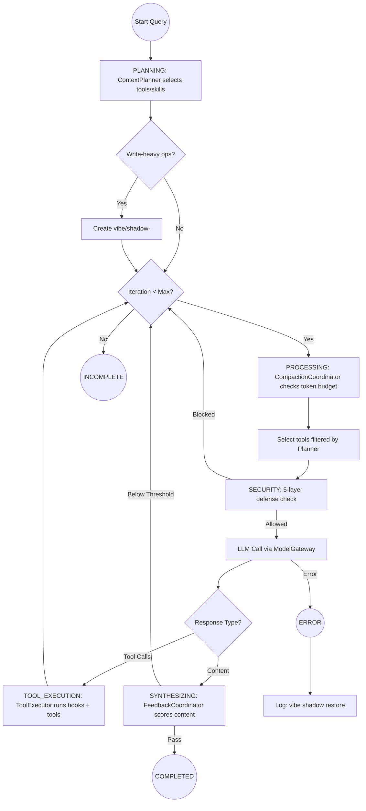

# Vibe Agent Architecture Wiki

Vibe Agent is a high-performance, resilient, and secure agent harness. Unlike many agent frameworks that focus on the model, Vibe Agent treats the **harness** as the primary product—ensuring that the LLM is managed with rigorous error recovery, safety constraints, automated evaluation, self-improvement, and multi-agent orchestration.

---

## 1. System Philosophy

*   **Model Agnosticism**: Hop between models and providers (OpenAI, Anthropic, Ollama, OpenRouter, Kimi) seamlessly via adapter-based gateway with circuit breakers and latency-aware routing.
*   **Zero-Trust Tools**: All tools (Bash, File) are "jailed" and subjected to 5-layer validation before execution.
*   **Stability over Speed**: Built-in circuit breakers, exponential backoff, provider fallback, cost tracking, and shadow workspace rollbacks ensure the agent remains stable even when remote APIs are flailing or tasks fail.
*   **Empirical Progress**: Every architectural change must be validated against the `vibe eval` suite. 50+ built-in evals, adversarial testing, multi-model scorecards, and soak tests.
*   **Self-Improvement**: The agent detects recurring patterns from its own usage and generates new skills automatically via the Skill-Maker pipeline.
*   **Collective Intelligence**: Multi-agent swarm with specialized sub-agents (Research, Coding, Critic, Planner) coordinated via DAG-based scheduling.

---

## 2. System Overview

### 2.1 Overall Architecture Diagram

```
┌─────────────────────────────────────────────────────────────────────────┐
│                    User Interface Layer                                 │
│    (Typer CLI + Rich  │  React Dashboard  │  Swarm Orchestrator)       │
└────────────────────────┬────────────────────┬───────────────────────────┘
                         │                    │
                         ▼                    ▼
┌─────────────────────────────────────────────────────────────────────────┐
│                      Query Loop (State Machine)                         │
│   (Context Planner, Compactor, Hook Pipeline, Security, Preferences)    │
└──────────────┬─────────────┬─────────────┬────────────────┬─────────────┘
               │             │             │                │
               ▼             ▼             ▼                ▼
┌───────────────────┐ ┌─────────────┐ ┌────────────────┐ ┌───────────────┐
│   Model Gateway   │ │ Tool System │ │  Memory Stack  │ │   Swarm       │
│ (Multi-Provider,  │ │ (Bash, File,│ │ (TraceStore,   │ │ (SubAgents,   │
│  Fallback, CB,    │ │  Skills,    │ │  Wiki, Eval,   │ │  TaskDAG,     │
│  Cost Router)     │ │  MCP Bridge)│ │  Telemetry)    │ │  EventBroker) │
└───────────────────┘ └─────────────┘ └────────────────┘ └───────────────┘
        │                                              │
        ▼                                              ▼
┌───────────────────┐                      ┌───────────────────────────┐
│  Skill-Maker      │                      │  Shadow Workspace         │
│  (Pattern Detect, │                      │  (Git shadow branches,    │
│   LLM Generate,   │                      │   auto-restore on fail)   │
│   Validate,       │                      └───────────────────────────┘
│   Propose)        │
└───────────────────┘
```

> [!TIP]
> **Interactive Version Available:** View the [Interactive System Architecture Diagram](assets/system_architecture.html) directly in your browser to explore detailed component breakdowns, hover effects, and the complete tech stack.

---

## 3. Query Loop Flow

The `QueryLoop` is a state-machine-driven async generator (`vibe/core/query_loop.py`, ~1170 lines) that manages the agent's "thought-action" cycle.

### 3.1 States

```python
class QueryState(Enum):
    IDLE = auto()
    PLANNING = auto()
    PROCESSING = auto()
    TOOL_EXECUTION = auto()
    SYNTHESIZING = auto()
    COMPLETED = auto()
    INCOMPLETE = auto()   # max_iterations exhausted
    STOPPED = auto()      # user interrupted
    ERROR = auto()
```

### 3.2 Loop Flowchart


```mermaid
graph TD
    Start((Start Query)) --> Planning[PLANNING: ContextPlanner selects tools/skills]
    Planning --> ShadowCheck{Write-heavy ops?}
    ShadowCheck -- Yes --> CreateShadow[Create vibe/shadow-<session-id>]
    ShadowCheck -- No --> LoopStart
    CreateShadow --> LoopStart
    
    LoopStart{Iteration < Max?} -- Yes --> Compaction[PROCESSING: CompactionCoordinator checks token budget]
    Compaction --> ToolSelection[Select tools filtered by Planner]
    ToolSelection --> Security[SECURITY: 5-layer defense check]
    Security -- Blocked --> LoopStart
    Security -- Allowed --> LLMCall[LLM Call via ModelGateway]
    
    LLMCall --> CheckResponse{Response Type?}
    
    CheckResponse -- Tool Calls --> ToolExec[TOOL_EXECUTION: ToolExecutor runs hooks + tools]
    ToolExec --> LoopStart
    
    CheckResponse -- Content --> Feedback[SYNTHESIZING: FeedbackCoordinator scores content]
    Feedback -- Below Threshold --> LoopStart
    Feedback -- Pass --> End((COMPLETED))
    
    LoopStart -- No --> Incomplete((INCOMPLETE))
    LLMCall -- Error --> ErrorState((ERROR))
    ErrorState --> OfferRollback[Log: vibe shadow restore <session-id>]
```

### 3.3 Key Behaviors

- **Planning:** `ContextPlanner` uses a tiered approach:
    1. **Keyword match** on tool/skill/MCP names.
    2. **fastText similarity** using the shared embeddings module.
    3. **LLM Router** (if configured).
    4. **Safety fallback** (return all tools).
- **Compaction:** Triggered before every LLM call if estimated tokens exceed threshold. Four strategies: `TRUNCATE` (default), `LLM_SUMMARIZE`, `OFFLOAD`, `DROP`.
- **Security:** `SecurityCoordinator` evaluates every tool call through 5 layers: pattern scanning, file safety, learned approval rules, human approval gates, smart approver, and checkpoints.
- **Feedback:** `FeedbackCoordinator` evaluates content responses via `FeedbackEngine`. Score below threshold (default 0.7) → inject retry hint and continue loop.
- **Shadow Protection:** `ToolExecutor` auto-creates a git shadow branch before the first write-heavy operation per session. On ERROR/INCOMPLETE, `QueryLoop` logs a rollback hint.
- **Skill-Maker:** On COMPLETED, spawns background `SkillMakerPipeline.run_once()` to detect patterns and propose new skills.
- **Iteration limit:** `max_iterations` (default 50) with adaptive budget allocation based on task complexity.
- **Background Extraction & Telemetry:** Upon loop completion, async knowledge extraction + RLM threshold analyzer + skill-maker all spawn as fire-and-forget tasks.

---

## 4. Token Efficiency Design

Efficient token usage is a core design goal, implemented through three primary layers:

### 4.1 Context Planning (Pre-filtering)
`ContextPlanner` (`vibe/harness/planner.py`) selects relevant tools/skills/MCPs before the LLM call.
- **Current:** Keyword/substring scoring with "return all tools" fallback.
- **Target:** Hybrid tiered planner (keyword fast-path → embedding fallback → LLM router).

### 4.2 Automated Context Compaction
`CompactionCoordinator` (`vibe/core/coordinators.py`) monitors token usage before every LLM call.
- **Strategies:** `TRUNCATE` (default), `LLM_SUMMARIZE`, `OFFLOAD`, `DROP`.
- **Current default:** Placeholder summary (`[Context summarized: N messages omitted]`). Real LLM summarization wired when LLM client available.
- **Estimation:** Uses `tiktoken` (cl100k_base) when available; falls back to chars/4.
- **Message capping:** Individual tool results capped at `max_chars_per_msg` (default 4000).
- **Adaptive Budgets:** Complexity-based depth allocation replaces hard `max_iterations=50`.

### 4.3 Feedback Loops (Turn Reduction)
`FeedbackCoordinator` acts as a quality gate.
- Catches malformed or low-quality responses locally via `FeedbackEngine`.
- Provides specific fix hints to prevent hallucination loops.
- **Status enum:** `OK`, `BELOW_THRESHOLD`, `ENGINE_ERROR`, `VALIDATION_ERROR` — explicit failure mode tracking.

---

## 5. Component Deep Dive

### 5.1 Model Gateway (`vibe/core/model_gateway.py`)
The gateway is the "resilience layer" for all LLM communication.
*   **Adapters:** Supports `OpenAIAdapter` and `AnthropicAdapter` via adapter registry.
*   **Registry-Aware Resolution:** `ProviderRegistry` dynamically resolves `base_url`, `api_key`, `adapter`, and `extra_headers` per provider.
*   **Circuit Breaker:** Per-model state. Opens after `threshold` consecutive failures (default 5), cooldown 60s. **Shared with FlashLLMClient** via `SharedCircuitBreaker`.
*   **Fallback Chain:** Configurable model chain with `auto_fallback`. Rate limits (429) do NOT trigger fallback.
*   **Cost Tracking:** `CostTracker` with per-session + daily + global spend limits and `BudgetExceededError`.
*   **Latency Routing:** `LatencyAwareRouter` with rolling p50/p95 stats and error-rate filtering.
*   **Structured Output:** `structured_output()` method forces JSON schema compliance with markdown cleanup.
*   **Debug Mode:** Redacted header logging to stderr.

### 5.2 Coordinators (`vibe/core/coordinators.py`)
Responsibilities extracted from `QueryLoop` for testability:
1.  **ToolExecutor**: Manages tool execution, `HookPipeline` (PRE/POST constraints), MCP fallback, and **shadow workspace auto-creation** on write-heavy ops. Sequential execution with exception isolation per tool call.
2.  **FeedbackCoordinator**: Manages self-verification and retry hints. Threshold-based with max retry cap.
3.  **CompactionCoordinator**: Triggers `ContextCompactor` logic before LLM calls.
4.  **SecurityCoordinator**: 5-layer defense (pattern scanning → file safety → learned rules → human approval → smart approver → checkpoints).
5.  **Session Recovery**: `SessionRecoveryManager` with TTL-based checkpoints for crash recovery.
6.  **Adaptive Budget**: `AdaptiveBudgetAllocator` with complexity-based depth budgets replacing hard `max_iterations=50`.

### 5.3 Preference Layer (`vibe/preferences/`)
Converts user feedback into persistent, testable, code-based heuristics. All features default-disabled, opt-in via config.
*   **Registry** (`registry.py`): SQLite WAL-backed persistence across 7 domains. Batch hit counting (in-memory, flushed on session end). INFERRED-only stale rule pruning.
*   **Tool Preferences** (`tool_prefs.py`): Default argument overrides per tool with glob pattern matching. Wired into `ToolExecutor`.
*   **Approval Rules** (`approval_rules.py`): Learned auto-approve/deny. Deny-before-allow evaluation. Path traversal protection via `Path.resolve()` + dual-match. Wired into `SecurityCoordinator`.
*   **Style Policy** (`style_policy.py`): User-tuned system prompt injection (verbosity, plan format, confirm threshold). Wired into `QueryLoop.run()`.
*   **Macro Sessions** (`macro_session.py`): User-defined multi-step YAML workflows with Jinja2 templating and `SandboxedEnvironment`. Wired into `vibe macro run` CLI via `QueryLoopFactory`.
*   **Recovery Rules** (`recovery_rules.py`): Pattern-based error recovery with per-session attempt limits. Wired into `QueryLoop` error handler.
*   **Compaction Policy** (`compaction_policy.py`): User-tuned context window management (max tokens, preserve recent N, per-tool priority). Wired into `ContextCompactor`.
*   **Provider Matrix** (`provider_prefs.py`): Per-task model routing with confidence scoring and fallback chains. Wired into `CostRouter.route()`.
*   **Extraction Policy** (`extraction_policy.py`): Wiki knowledge filtering (skip patterns, auto-tags, merge threshold). Wired into `KnowledgeExtractor`.
*   **Initialization**: All 8 preferences initialized lazily in `QueryLoopFactory.create()` with config-gated `*_enabled` flags. Graceful fallback on import/init failure.

### 5.4 Tool System & Security (`vibe/tools/`)
*   **Bash Sandbox:** Uses `subprocess_exec` (no shell) + regex denylist (`sudo`, `rm -rf /`, etc.).
*   **File Jail:** `_resolve_and_jail()` prevents path traversal even via symlinks.
*   **Hook Pipeline:** 5 stages (`PRE_VALIDATE → PRE_MODIFY → PRE_ALLOW → POST_EXECUTE → POST_FIX`).
*   **SecurityCoordinator:** 5-layer defense with `SecurityCheckResult` per layer.
    - Layer 1: PatternEngine scans for dangerous commands.
    - Layer 2: FileSafetyGuard validates paths against safe_root.
    - Layer 3: HumanApprover with manual/smart/auto/strict modes.
    - Layer 4: SmartApprover with LLM-based risk assessment.
    - Layer 5: CheckpointManager creates rollback points before destructive ops.
*   **Shadow Workspace** (`git_shadow.py`): `ShadowBranchManager` creates hidden git branches before write-heavy operations. `NoOpShadowManager` for non-git environments. Auto-detects write-heavy ops (`write_file`, `delete_file`, `bash` with destructive patterns, etc.).

### 5.5 Skill System v2 (`vibe/harness/skills/`)
Native skill format with TOML frontmatter (`+++` delimited):
*   **Parser:** `SkillParser` parses TOML frontmatter + markdown body.
*   **Models:** Pydantic v2 validation for IDs, unique step IDs, safe formats.
*   **Validator:** Security scanning (fs destruction, pipe-to-shell, eval injection, suspicious URLs, hardcoded credentials).
*   **ApprovalGate:** Protocol with `CLIApprovalGate`, `AutoApproveGate`, `AutoRejectGate`.
*   **Installer:** Atomic installation from git, tarball (zip-slip protection), or local path.
*   **Executor:** Step execution with variable substitution and verification.
*   **Typed Variables:** `TypedSkillExecutor` with type coercion (int/float/bool/str/list/dict), default values, and schema validation.
*   **Orchestrator:** `SkillOrchestrator` enables skills to `await` other skills and spawn sub-agents via `asyncio.gather`.
*   **Marketplace:** `SkillMarketplace` with JSON registry, search, install, and rating support.
*   **Dynamic Tools:** `DynamicToolRegistry` allows skills to declare new tools at runtime.
*   **Skill-Maker** (`maker.py`): **NEW** — Self-improving pipeline:
    - `detect_patterns()`: Scans wiki for recurring tags above frequency threshold.
    - `generate_skill()`: LLM generates SKILL.md draft with prompt injection sanitization.
    - `validate_skill()`: Runs through `SkillValidator` sandbox.
    - `propose_installation()`: Presents to user via `ApprovalGate`.
    - `run_once()`: End-to-end pipeline callable from `QueryLoop` background task.
    - Config: `SkillMakerConfig` with `enabled`, `min_pattern_frequency`, `confidence_threshold`, `max_skills_per_session`.

### 5.6 Memory (`vibe/harness/memory/`)
*   **TraceStore:** Scalable backend (SQLite, JSON, or Memory) for session persistence.
    - **Persistence:** `QueryLoop` automatically logs sessions on completion via `finally` block.
    - **Optimization:** Switched from `pickle` to `numpy` float32 for 4x smaller and faster embedding storage.
    - **Atomicity:** `JSONTraceStore` uses temp-file + rename pattern for corruption protection.
*   **Embeddings Unification** (`vibe/harness/embeddings.py`):
    - **Standard:** Unified on **sentence-transformers** (`all-MiniLM-L6-v2`, 384-dim) with fastText fallback.
    - **Performance:** Singleton loader with 1000-entry LRU cache.
    - **Search:** Vector similarity with keyword pre-filtering to minimize search space.
*   **Secret Redactor** (`vibe/harness/security/redactor.py`):
    - Standardized layer for stripping credentials (OpenAI, AWS, GitHub, etc.) before they hit any persistence layer (TraceStore, EvalStore, Audit Logs).
*   **EvalStore:** SQLite storage for `evals` and `eval_results`.
*   **Tripartite Memory System**:
    - **LLMWiki** (`wiki.py`): Markdown-based long-term memory with strict file locking and parallelized backlink resolution. Uses FlashLLM for contradiction detection.
    - **KnowledgeExtractor** (`extraction.py`): Asynchronous background knowledge extraction utilizing `asyncio.gather` for parallel novelty scoring and confidence gating.
    - **RLMThresholdAnalyzer** (`rlm_analyzer.py`): Telemetry-driven analysis evaluating session tokens and compaction rates to trigger Recursive Language Model training. **Launches actual LoRA fine-tuning** via background task + subprocess worker.
    - **PageIndex** (`pageindex.py`): Vector-based routing with `UpgradedVectorIndex` (sentence-transformers with fallback).
    - **WikiGraph** (`wiki_graph.py`): Entity nodes, relationship edges, and entity resolution via alias merging.
    - **Novelty Thresholds** (`novelty_thresholds.py`): Per-tag/per-domain thresholds for nuanced deduplication.
    - **TelemetryCollector** (`telemetry_collector.py`): Decoupled telemetry API for CLI and services.
    - **Semantic Deduplication** (`semantic_dedup.py`): Vector similarity for `_find_existing_page` with Jaccard fallback.

---

## 6. Eval Infrastructure (`vibe/evals/`)

### 6.1 Components
*   **EvalRunner** (`runner.py`): Core execution engine. Reuses `QueryLoop` instance (use `FactoryEvalRunner` for isolation).
*   **FactoryEvalRunner** (`factory_runner.py`): Fresh `QueryLoop` per eval case via factory function. Eliminates state bleed.
*   **Adversarial Evals** (`adversarial.py`): Pattern-based prompt injection, jailbreak, and exfiltration detection.
*   **Eval Dashboard** (`dashboard.py`): Dark-themed HTML report generator with pass-rate bars and run history.
*   **MultiModelRunner** (`multi_model_runner.py`): Runs suite against multiple models, produces `Scorecard` with per-tag breakdowns. Correctly creates fresh `QueryLoop` per model.
*   **SoakTestRunner** (`soak_test.py`): Long-running stress tests with degradation detection (first 20% vs last 20% latencies). Correctly creates fresh `QueryLoop` per case.
*   **Observability** (`observability.py`): OpenTelemetry-style spans, counters, gauges, histograms. Export to JSON.

### 6.2 Assertion Types (11)
`file_exists`, `file_contains` + `contains_text`, `stdout_contains`, `response_contains`, `response_contains_any`, `min_response_length`, `tool_called`, `tool_sequence`, `no_tool_called`, `context_truncated`, `metrics_threshold`.

---

## 7. Dashboard (`vibe/dashboard/`)

### 7.1 Backend
*   **FastAPI Server** (`server.py`): Session/wiki/skill/telemetry endpoints. WebSocket live updates. Token auth.
*   **Data Layer** (`data.py`): Async wrappers around TraceStore, LLMWiki, SkillInstaller, TelemetryCollector.
*   **API Endpoints**: `/api/sessions`, `/api/wiki/pages`, `/api/wiki/graph`, `/api/skills`, `/api/telemetry`, `/api/stats`, `/api/config`.
*   **Security**: Binds to 127.0.0.1, strict CORS (localhost only), read-only API.

### 7.2 Frontend
*   **React 18** (CDN-loaded, no build step): Stat cards, session list, D3.js wiki graph, Recharts telemetry.
*   **Dark Theme**: CSS custom properties, Inter + JetBrains Mono fonts.
*   **CLI**: `vibe dashboard start --port 8080`.

---

## 8. Multi-Agent Swarm (`vibe/swarm/`)

### 8.1 AgentProtocol
*   **EventBroker** (`protocol.py`): Pub/Sub message bus with topic-based routing.
    - `AgentMessage`: Immutable, correlation_id for request/response tracking.
    - Topics: message type + "all" + agent-specific.
    - Broadcast deduplication, Dead Letter Queue.
*   **MessageBus**: High-level wrapper with `register_agent`/`send`/`broadcast`/`shutdown`.

### 8.2 SubAgent
*   **Roles**: RESEARCH, CODING, CRITIC, PLANNER with role-specific system prompts.
*   **Scratchpad**: Isolated working memory per agent.
*   **Lifecycle**: SPAWNED → ACTIVE → IDLE → TERMINATED with ready event.

### 8.3 SwarmOrchestrator
*   **TaskDAG**: Directed Acyclic Graph with prerequisite tracking.
*   **Scheduler**: Runs ready nodes in parallel, respects dependencies via semaphore.
*   **Decomposition**: research → coding → critique pipeline (LLM-based in production).
*   **Synthesis**: Aggregates sub-agent outputs into markdown report.

### 8.4 SharedWiki
*   Read-only access for all sub-agents.
*   Write-via-message: agents send `UPDATE_WIKI` requests, orchestrator applies sequentially.

---

## 9. Shadow Workspace (`vibe/tools/git_shadow.py`)

### 9.1 ShadowBranchManager
*   **Create**: `create_shadow(session_id)` → creates `vibe/shadow-<session-id>` branch, stashes uncommitted changes, stores metadata in git config.
*   **Restore**: `restore_shadow(session_id)` → checks out shadow branch, resets to original state, restores original branch.
*   **List**: `list_shadows()` → returns all shadow branches with metadata (original branch, creation time, uncommitted changes flag).
*   **Clean**: `clean_shadows(older_than_days)` → removes shadows older than threshold based on reflog timestamps.
*   **Write-Heavy Detection**: `is_write_heavy_operation(tool_name, args)` → detects `write_file`, `delete_file`, `bash` with destructive patterns, shell redirections, etc.

### 9.2 Integration Points
*   **ToolExecutor**: Auto-creates shadow on first write-heavy operation per session (once, gated by `_shadow_created` flag).
*   **QueryLoop**: Logs rollback hint in `finally` block when session ends in ERROR/INCOMPLETE.
*   **QueryLoopFactory**: Auto-wires `ShadowBranchManager` when `shadow_workspace.enabled=True`.
*   **Config**: `ShadowWorkspaceConfig` with `enabled` and `auto_rollback` fields.

---

## 10. Skill-Maker Pipeline (`vibe/harness/skills/maker.py`)

### 10.1 Pipeline Stages
1.  **Detect**: Scans `LLMWiki` for tags with frequency ≥ `min_pattern_frequency`. Returns `DetectedPattern` with tag, page titles, suggested tools, confidence score.
2.  **Generate**: Builds sanitized prompt from pattern summary. LLM generates SKILL.md draft with TOML frontmatter. Prompt injection protection via `_sanitize_for_prompt()`.
3.  **Validate**: Parses generated markdown via `SkillParser`. Runs `SkillValidator` security scan. Returns `ValidationResult`.
4.  **Propose**: Creates `SkillProposal` with install command. Presents to user via `ApprovalGate` (`AutoApproveGate` in headless mode).

### 10.2 Integration Points
*   **QueryLoop**: Spawns `skill_maker.run_once()` as background `asyncio.Task` on session COMPLETED. Guarded by `_skill_maker_task` state to prevent concurrent runs.
*   **QueryLoopFactory**: Auto-wires `SkillMakerPipeline` when `skill_maker.enabled=True`. Passes `wiki` and `llm_client` references.
*   **Config**: `SkillMakerConfig` with `enabled`, `min_pattern_frequency`, `confidence_threshold`, `max_skills_per_session`, `excluded_tags`.

---

## 11. Configuration & Quality

*   **Hierarchical Config:** Default → `~/.vibe/config.yaml` → Environment Variables (`VIBE_*`).
*   **Security Config:** `approval_mode` (manual/smart/auto), file safety, env sanitization, sandbox backend, audit logging.
*   **Evaluation Suite:** 50+ built-in cases in `vibe/evals/builtin/`.
*   **Scorecards:** JSON + Markdown performance reports generated per model run.

---

*Last Updated: 2026-05-16 (v0.3.5-alpha)*
