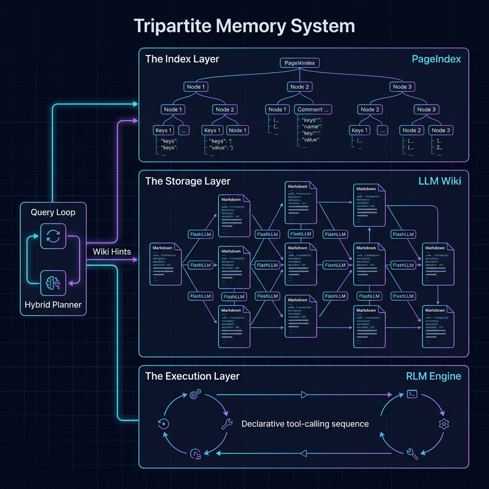

# Vibe Agent — Tripartite Memory System: Design Document v4

**Date:** 2026-04-26  
**Scope:** Merge the Tripartite Memory System into the existing `vibe-agent` memory architecture  
**Status:** Design Phase v4 — Incorporates Gemini + Kimi + Hermes consolidated review feedback  
**Target File:** `~/DevSpace/vibe-agent/docs/TRIPARTITE_MEMORY_DESIGN.md`  
**Previous Version:** v3 (`docs/TRIPARTITE_MEMORY_DESIGN.md`)  
**Review Reference:** `docs/TRIPARTITE_DESIGN_REVIEW_consolidated.md`

---

## 1. Executive Summary

The current `vibe-agent` memory system is a multi-tier persistence layer with:
- **Trace store** (SQLite/JSON) for episodic session logging
- **Eval store** (SQLite) for benchmark regression tracking
- **Context compactor** (in-flight token-budget compaction)
- **Planner query cache** (in-memory LRU)
- **Wiki memory** (archived flat markdown files)

The **Tripartite Memory System** replaces the vector-based similarity search paradigm with a human-textbook model:
1. **The Index** (PageIndex) — a JSON "Table of Contents" that the LLM reasons over to route queries
2. **The Storage** (LLM Wiki) — interlinked Markdown files with YAML frontmatter, incrementally maintained
3. **The Execution** (RLM) — a declarative JSON tool-calling loop for processing documents beyond context limits

**Key principle for v4 (changed from v3):** Phase 1 (Wiki + PageIndex) is **explicit, opt-in memory augmentation** — not a planner tier. The user triggers wiki writes. Phase 2 (RLM) is deferred until real usage data justifies it. Auto-extraction is gated behind quality signals.

**v4 changes from v3:**
- **FIXED:** PageIndex retrieval moved out of sync planner into async `QueryLoop.run()` (P0-1)
- **FIXED:** Factory now wires `trace_store` before tripartite components (P0-3)
- **FIXED:** Human-readable wiki links (`[[slug]]`) instead of UUIDs (P2-2)
- **FIXED:** BM25 threshold replaced with percentile-based novelty gate (P2-1)
- **FIXED:** `AsyncFileLock` (filelock>=3.8) for async-safe concurrency (P1-3)
- **FIXED:** Schema version table + `MigrationManager` for database migration (P1-4)
- **FIXED:** Keyword-only arguments for backward-compatible planner integration (P2-4)
- **FIXED:** RLM config reduced to placeholder `enabled: bool = False` in Phase 1a (P2-5)
- **ADDED:** `FlashLLMClient` contract defined for quality gates (P1-2)
- **ADDED:** Telemetry collection in `ContextCompactor` for Phase 2 trigger (P2-5)

---

## 2. Current State vs. Target State

### 2.1 Current Memory Architecture

| Component | Purpose | Persistence | Key Gap |
|-----------|---------|-------------|---------|
| `SQLiteTraceStore` | Session logging + vector similarity | `~/.vibe/memory/traces.db` | Keyword pre-filter defeats semantic search (FIXED in v4) |
| `JSONTraceStore` | File-based session logging | `~/.vibe/memory/traces.json` | Full rewrite per log |
| `EvalStore` | Benchmark results | `~/.vibe/memory/evals.db` | Well-scoped |
| `ContextCompactor` | Token-budget compaction | In-flight only | TRUNCATE/LLM_SUMMARIZE/OFFLOAD/DROP |
| `HybridPlanner` | Tool/skill selection + query cache | In-memory LRU | 4-tier planner (keyword → embedding → LLM → fallback) |
| `QueryLoop.messages` | Conversation history | None (in-memory) | Lost on process exit |
| `WikiMemory` (archived) | Cross-session knowledge pages | `~/.vibe/wiki/*.md` | **Inactive** |

### 2.2 Target Architecture (Tripartite Integration)



| Layer | Replaces / Augments | New Component | Persistence |
|-------|---------------------|---------------|-------------|
| **Index** | Augments planner with memory hints | `PageIndex` | `~/.vibe/memory/index.json` |
| **Storage** | Revives `WikiMemory` as opt-in knowledge store | `LLMWiki` | `~/.vibe/wiki/*.md` |
| **Execution** | Deferred to Phase 2 | `RLMEngine` | In-flight declarative loop |
| **Trace Store** | Retained unchanged (vector search kept as optional) | `SQLiteTraceStore` | `~/.vibe/memory/traces.db` |
| **Eval Store** | Unchanged | `EvalStore` | `~/.vibe/memory/evals.db` |
| **Planner** | Retains all 4 tiers unchanged; receives wiki hints via `PlanRequest` | `HybridPlanner` | In-memory LRU |

---

## 3. Layer 1: The Storage Layer (LLM Wiki)

### 3.1 Concept

Andrej Karpathy's "LLM Wiki" pattern: the LLM incrementally builds and maintains a persistent, interlinked collection of Markdown files. Knowledge is compiled once and kept current.

**v4 principle:** Wiki writes are **explicit and gated**, not automatic. The user triggers creation with `vibe memory wiki create` or a confirmation prompt. Auto-extraction (Phase 1b) requires a quality signal and is disabled by default.

### 3.2 File Schema

All files saved as `.md` with YAML frontmatter:

```yaml
---
id: a1b2c3d4-e5f6-7890-abcd-ef1234567890  # UUID, never changes
title: Infrastructure Logs
date_created: 2026-04-10
last_updated: 2026-04-26
tags: [database, scaling, servers]
status: draft|verified  # See §3.5 for promotion rules
citations:
  - session: session_uuid_abc123
    date: 2026-04-10
    summary: "Database read-replica lag identified as scaling bottleneck"
ttl_days: 30  # Auto-expire draft pages after N days
---

# Infrastructure Logs

Content goes here with [[infrastructure-logs]] links to other docs...
```

**Schema decisions (v4):**
- `id`: UUID (not `doc_004` sequence) — eliminates race conditions
- `citations`: Inline provenance, not just `source_session` — survives trace store retention
- `ttl_days`: Auto-expiration for draft pages — prevents garbage accumulation
- `status`: `draft` (default) or `verified` — see §3.5 for promotion rules
- **v4 CHANGE:** Wiki links use `[[slug]]` with title as rendered label — human-readable, resolved via index mapping at read time. UUIDs are stored in YAML frontmatter only.

### 3.3 Wiki Operations API

```python
class LLMWiki:
    def create_page(self, title: str, content: str, tags: list[str],
                    citations: list[dict], status: str = "draft") -> WikiPage
    def update_page(self, page_id: str, content: str | None = None,
                    tags: list[str] | None = None, citations: list[dict] | None = None) -> WikiPage
    def get_page(self, page_id: str) -> WikiPage | None
    def search_pages(self, query: str, limit: int = 10) -> list[WikiPage]
    def list_pages(self, tag: str | None = None, status: str | None = None) -> list[WikiPage]
    def delete_page(self, page_id: str) -> bool
    def get_backlinks(self, page_id: str) -> list[WikiPage]
    def expire_drafts(self, cutoff_days: int = 30) -> int  # Returns count expired
```

### 3.4 Concurrency Safety (Async File Locking)

**v4 CHANGE:** All write operations use `AsyncFileLock` (from `filelock>=3.8`) instead of sync `FileLock`:

```python
from filelock import AsyncFileLock

# Lock hierarchy rule: index lock ALWAYS acquired first, then page locks
# This prevents the rebuild() vs update_page() deadlock

async def _acquire_locks(self, pages: list[WikiPage]) -> AsyncContextManager:
    async with AsyncFileLock(f"{self.index_path}.lock"):  # 1. Index lock (outer)
        page_locks = [AsyncFileLock(f"{p.path}.lock") for p in sorted(pages, key=lambda p: p.path)]
        async with AsyncExitStack() as stack:
            for lock in page_locks:
                await stack.enter_async_context(lock)  # 2. Page locks (inner, deterministic order)
            yield
```

**Rules:**
- Single-page edits: acquire page lock only
- Rebuild operations: acquire index lock first, then page locks in deterministic order (sorted by path)
- No nested page lock acquisitions in reverse order
- **v4 CHANGE:** All lock operations are async-safe; never block the event loop

### 3.5 Quality Gates and Verification Lifecycle

**Status promotion rules:**

| Status | How it enters | How it promotes | How it exits |
|--------|---------------|-----------------|--------------|
| `draft` | Default on creation | To `verified`: requires ≥2 citations from distinct sessions AND no contradictions detected in wiki | To `expired`: after `ttl_days` without update |
| `verified` | Promotion from draft | N/A — stays verified unless manually demoted | To `draft`: if contradicted by new evidence |
| `expired` | Auto-expiration of draft | N/A — candidate for deletion | Deleted by `expire_drafts()` or manual cleanup |

**Contradiction detection:** Before writing/updating a page, query the wiki for pages with overlapping tags. Use a cheap LLM call (flash model) to check for factual conflicts. If contradiction detected, flag both pages for review and keep the new page as `draft`.

**v4 CHANGE:** Contradiction detection requires `FlashLLMClient` (see §12). Without a configured flash model, contradiction detection is skipped with a warning log.

**Novelty signal for auto-extraction (Phase 1b):**
- Only extract if session contains ≥1 novel tool result (new file path, new command, new error)
- Only extract if the extractor LLM assigns confidence ≥0.8
- **v4 CHANGE:** Only extract if content is not a near-duplicate of an existing page (top-3 BM25 similarity < 90th percentile of corpus) — replaces bogus "BM25 < 0.9" threshold

### 3.6 Integration with QueryLoop

**Phase 1a (default, manual):**
- User runs `vibe memory wiki create` or `vibe memory save` to explicitly save session insights
- No automatic extraction at session end

**Phase 1b (optional, gated auto-extraction):**
- Config: `memory.wiki.auto_extract: false` (default)
- When enabled, extraction runs via `asyncio.create_task()` (not `threading.Thread`)
- Task reference stored on `QueryLoop`; cancelled in `close()` if still running
- Extraction prompt template is configurable; defaults to extracting decisions, file edits, and errors only

```python
class QueryLoop:
    def __init__(self, *, wiki: LLMWiki | None = None, **kwargs):
        self.wiki = wiki
        self._wiki_extract_task: asyncio.Task | None = None
    
    async def close(self) -> None:
        # v4 CHANGE: Close all closable subsystems via protocol
        for subsystem in [self.trace_store, self.feedback_engine, self.context_compactor, self.wiki]:
            if subsystem and hasattr(subsystem, 'close'):
                await subsystem.close()
        
        if self._wiki_extract_task and not self._wiki_extract_task.done():
            self._wiki_extract_task.cancel()
            try:
                await self._wiki_extract_task
            except asyncio.CancelledError:
                pass
        # ... existing close logic
```

### 3.7 What Replaces What

| Current | Replacement | Rationale |
|---------|-------------|-----------|
| `trace_store.get_similar_sessions()` (vector search) | **Kept unchanged** | Trace store memory augmentation continues working; wiki is additive |
| `WikiMemory` (archived) | `LLMWiki` (active, enhanced) | Revive with proper schema, quality gates, and QueryLoop wiring |
| Keyword pre-filter in vector search | **REMOVED** | v4 fixes semantic search by removing aggressive keyword pre-filter (see §8.1) |

---

## 4. Layer 2: The Index Layer (PageIndex)

### 4.1 Concept

PageIndex: a vectorless, reasoning-based RAG system. The LLM reads a JSON "Table of Contents" and uses logic to decide which sections hold the answer.

**v4 principle:** PageIndex is **memory augmentation**, not a planner tier. It runs **before** (not inside) the planner, in the async `QueryLoop.run()` context. It passes wiki hints via `PlanRequest`, similar to how `trace_store.get_similar_sessions()` injects historical context today.

### 4.2 Index Schema

Single `index.json` file, hierarchical tree with sub-index support:

```json
{
  "wiki_index": {
    "node_id": "root_01",
    "title": "Master Knowledge Base",
    "description": "Top-level index for all agent knowledge.",
    "sub_nodes": [
      {
        "node_id": "cat_dev",
        "title": "Development",
        "description": "Coding, tools, and development workflows.",
        "sub_index_path": "index_dev.json",
        "tags": ["dev", "coding"],
        "sub_nodes": []
      },
      {
        "node_id": "doc_004",
        "title": "Infrastructure Logs",
        "description": "Historical data on server performance, database scaling, and outages.",
        "file_path": "/wiki/infrastructure_logs.md",
        "tags": ["database", "scaling", "servers"],
        "sub_nodes": []
      }
    ]
  }
}
```

**New field:** `sub_index_path` — references a category sub-index file. Enables hierarchical partitioning.

### 4.3 Hierarchical Index Partitioning

**Trigger conditions:** Partitioning activates when EITHER:
- Root index exceeds `token_threshold` (default: 4000 tokens), OR
- Root index exceeds `max_nodes_per_index` (default: 100 nodes)

**Whichever threshold is hit first triggers partitioning.**

**Partitioning algorithm:**
1. **v4 CHANGE:** Deterministic tag-based bucketing (lexicographic sort of first tag) — replaces LLM categorization to ensure stability
2. LLM generates human-readable descriptions for each category (not assignments)
3. Each bucket becomes a sub-index file (`index_{category}.json`)
4. Root index is rewritten with category summary nodes (not individual pages)
5. Both root and sub-indexes are locked during rebuild

**Routing with sub-indexes:**
```
1. Load root index.json into LLM context
2. LLM reasons over category summaries → selects relevant sub-index
3. Load sub-index → LLM reasons over page nodes
4. Return ranked list of node_ids with confidence scores
5. Caller fetches corresponding wiki pages from LLMWiki
```

**Latency target:** 1–3s for full routing (root + sub-index). This is realistic for LLM-based reasoning and is documented as such.

### 4.4 Index Operations API

```python
class PageIndex:
    def load(self) -> IndexTree
    async def route(self, query: str) -> list[IndexNode]  # v4: async
    def add_node(self, parent_id: str, title: str, description: str,
                 file_path: str, tags: list[str]) -> IndexNode
    def update_node(self, node_id: str, **fields) -> IndexNode
    def remove_node(self, node_id: str) -> bool
    def rebuild(self, wiki: LLMWiki, incremental: bool = True) -> None
    def _partition_if_needed(self) -> None
```

**v4 CHANGE:** `route()` is now `async` to reflect its LLM-dependent nature.

**Incremental rebuild (default):** Only re-index the changed page and its parent category. Full rebuild is manual (`vibe memory wiki index rebuild`).

### 4.5 Integration with QueryLoop (v4: Moved Out of Planner)

**v4 CRITICAL CHANGE:** PageIndex retrieval happens in `QueryLoop.run()` (async context), NOT inside `HybridPlanner._keyword_plan()` (sync context).

```python
# In QueryLoop.run() (NEW v4 behavior):
async def run(self, query: str) -> AsyncIterator[str]:
    # ... existing setup ...
    
    # v4: Wiki retrieval happens HERE, in async context, before planner
    wiki_hint = ""
    if self.wiki is not None and self.pageindex is not None:
        try:
            wiki_nodes = await asyncio.wait_for(
                self.pageindex.route(query),
                timeout=self.config.memory.pageindex.routing_timeout_seconds  # default 2.0s
            )
            if wiki_nodes:
                wiki_hint = "\n\n## Relevant Knowledge\n" + "\n".join(
                    f"- [[{n.node_id}]] {n.title}: {n.description}" for n in wiki_nodes[:3]
                )
        except asyncio.TimeoutError:
            pass  # Fail gracefully, preserve planner latency
    
    # Pass wiki hint to planner via PlanRequest
    plan_request = PlanRequest(
        query=query,
        history_summary=...,  # existing
        wiki_hint=wiki_hint,  # NEW v4 field
    )
    
    # Planner remains SYNCHRONOUS — no async boundary crossed
    plan_result = self.planner.plan(plan_request)
    # ... rest of loop unchanged
```

```python
# In HybridPlanner._keyword_plan() (UNCHANGED sync context):
memory_hint = ""
if self.trace_store is not None:
    similar = self.trace_store.get_similar_sessions(request.query, limit=3)
    if similar:
        memory_hint = "\n\n## Historical Context\n..."

# v4: Wiki hint comes from PlanRequest, not from pageindex.route() call
if request.wiki_hint:
    memory_hint += request.wiki_hint
```

**Why this works (v4):**
- Planner latency is unchanged (~5ms keyword / ~5ms embedding) because PageIndex runs **before** planner, in async `QueryLoop.run()`
- PageIndex only adds hints to `PlanRequest.wiki_hint` — it does not block tool selection
- If PageIndex is slow (1–3s), `asyncio.wait_for()` skips it with a timeout guard (default: 2s)
- No sync/async boundary crossed — `HybridPlanner.plan()` remains synchronous

### 4.6 Hybrid Pre-Filter (BM25 + Optional Embeddings)

To avoid loading massive markdown files into the RLM when not needed, implement a lightweight SQLite pre-filter in the **shared** memory database:

**Shared database:** `~/.vibe/memory/memory.db` (replaces separate `traces.db`, `evals.db`, `wiki_chunks.db`)

```sql
-- Single database, multiple tables
CREATE TABLE sessions (...);        -- migrated from traces.db
CREATE TABLE evals (...);           -- migrated from evals.db
CREATE VIRTUAL TABLE wiki_chunks USING fts5(
    chunk_id, page_id, content, tokenize='porter'
);
CREATE TABLE chunk_meta (
    chunk_id TEXT PRIMARY KEY,
    page_id TEXT,
    start_offset INTEGER,
    end_offset INTEGER
);
```

**BM25 (FTS5):** Exact keyword matching for error codes, names, strict identifiers.  
**Optional semantic:** If `fasttext` is available, use `sqlite-vec` for conceptual proximity.  
**Fallback:** BM25-only is sufficient when embeddings are unavailable.

**Chunk sync strategy:** On wiki page edit, delete all chunks for that `page_id`, then re-chunk and re-insert. This is O(chunks) per edit, not O(total chunks).

**v4 CHANGE:** Use content hash to skip re-indexing if content hasn't changed:

```python
def _sync_chunks(self, page: WikiPage) -> None:
    content_hash = hashlib.sha256(page.content.encode()).hexdigest()[:16]
    existing = self.db.execute(
        "SELECT content_hash FROM chunk_meta WHERE page_id = ?", (page.id,)
    ).fetchone()
    if existing and existing[0] == content_hash:
        return  # Skip re-indexing — content unchanged
    # ... proceed with delete + re-insert
```

---

## 5. Layer 3: The Execution Layer (RLM Engine) — PHASE 2, DEFERRED

### 5.1 Status

The RLM Engine is **deferred to Phase 2**. Phase 1 ships without it. The rationale:
- Modern context windows (200K–1M tokens) make "document larger than context" rare
- The existing `ContextCompactor` handles 8K-token budgets adequately
- The RLM adds significant complexity (declarative plans, sub-LLM orchestration, rate limiting) for an edge case

**v4 CHANGE:** Phase 2 trigger condition requires telemetry data. See §8.2 for telemetry requirements.

### 5.2 Design (Ready for Phase 2)

When Phase 2 activates, the RLMEngine uses a **declarative JSON tool-calling loop** (no Python REPL):

```python
class RLMInterpreter:
    ALLOWED_TOOLS = {
        "load_chunk": _load_chunk,
        "query_chunk": _query_chunk,
        "merge_answers": _merge_answers,
        "filter_chunks": _filter_chunks,
    }
    
    async def execute_plan(self, plan: RLMPlan) -> str:
        self._validate_plan(plan)  # Schema + whitelist + arg sanitization
        return await self._execute_steps(plan.steps)
```

**Plan validation (CRITICAL-1 fix):**
```python
def _validate_plan(self, plan: dict) -> None:
    # 1. JSONSchema validation
    jsonschema.validate(plan, RLM_PLAN_SCHEMA)
    
    # 2. Tool name whitelist
    for step in plan["steps"]:
        if step["tool"] not in self.ALLOWED_TOOLS:
            raise RLMValidationError(f"Unknown tool: {step['tool']}")
    
    # 3. Argument sanitization (SecretRedactor on query_chunk prompts)
    for step in plan["steps"]:
        if step["tool"] == "query_chunk":
            prompt = step["args"].get("query", "")
            if self.redactor.scan(prompt):
                raise RLMValidationError("Prompt contains sensitive patterns")
    
    # 4. No circular references in output_var dependencies
    self._check_acyclic(plan["steps"])
```

**Plan generation:** The main LLM generates the plan via structured output (JSON mode). The prompt explicitly constrains available tools and requires the plan to be acyclic.

**Sub-LLM call management:**
- Default `max_concurrency=4`
- VRAM-aware: detect via `nvidia-smi` (Linux), `system_profiler` (macOS), or API query
- Token-bucket rate limiting: `TokenBucket(rpm=60, tpm=100000)`
- Per-step timeout (not per-query):
  ```python
  STEP_TIMEOUTS = {
      "load_chunk": 1.0,
      "query_chunk": 30.0,  # Configurable by sub-LLM model
      "merge_answers": 10.0,
      "filter_chunks": 2.0,
  }
  ```
- Per-chunk retry: exponential backoff, max 3 retries
- Fallback: if >50% of chunks fail, truncate and summarize directly

---

## 6. Data Flow: End-to-End Query Lifecycle

### 6.1 Typical Session (Phase 1a — Manual Wiki)

```
1. User types query in CLI
   └── query_loop.run("What database scaling problems did we have last month?")

2. QueryLoop appends user message to self.messages

3. Wiki retrieval (NEW v4: async, before planner)
   └── if pageindex is not None:
       └── await asyncio.wait_for(pageindex.route(query), timeout=2.0)
           └── Returns wiki_nodes (or skips on timeout)

4. Planning phase (UNCHANGED from existing behavior)
   └── HybridPlanner.plan(PlanRequest(query=..., wiki_hint=wiki_hint))
       ├── Tier 1: Keyword match → miss
       ├── Tier 2: fastText embedding → miss (or hit, if installed)
       ├── Tier 3: LLM router → selects relevant tools
       └── Tier 4: Fallback (not needed)
       
       └── Memory augmentation (UNCHANGED structure):
           ├── trace_store.get_similar_sessions() → injects historical context
           └── request.wiki_hint → injects wiki hints (if tripartite enabled)
               "## Relevant Knowledge\n- [[uuid]] Infrastructure Logs (database, scaling)"

5. Main loop iteration (UNCHANGED)
   ├── Build LLM messages
   ├── Check compaction
   ├── LLMClient.complete(messages, tools)
   └── Process response

6. Session ends
   ├── TraceStore.log_session() (episodic logging, unchanged)
   └── NO automatic wiki extraction (Phase 1a)
```

### 6.2 Explicit Wiki Save (User-Triggered)

```
User runs: vibe memory save

1. QueryLoop checks self.messages for novel content
2. Extractor LLM (cheap model) generates wiki page draft
3. User confirms or edits in $EDITOR
4. wiki.create_page(title="...", content="...", citations=[...])
5. pageindex.add_node(parent_id="root_01", ...)
```

### 6.3 Massive Document Query (Phase 2 — RLM, Deferred)

```
1. User asks: "Summarize all infrastructure decisions from the past year"

2. Planner routes to doc_004 (Infrastructure Logs)
   └── Wiki page is 500K characters

3. QueryLoop detects content > 100K chars
   └── Delegates to RLMEngine.query(...)

4. RLMEngine executes validated declarative plan:
   ├── Chunk into 10 chunks of ~50K (header-based)
   ├── Generate JSON plan (structured output from main LLM)
   ├── Validate plan (schema, whitelist, sanitization)
   ├── Execute with max_concurrency=4, rate limiting, per-step timeouts
   ├── Collect partial answers (retry on failure)
   ├── Merge answers
   └── Return final answer

5. QueryLoop receives final answer, appends to messages, yields to user
```

---

## 7. Component Changes & Migration Plan

### 7.1 Phase 1a: Standalone Wiki + PageIndex (Shippable)

**Files to create:**

| File | Purpose |
|------|---------|
| `vibe/memory/wiki.py` | `LLMWiki` class — CRUD, YAML frontmatter, file locking, quality gates |
| `vibe/memory/pageindex.py` | `PageIndex` class — JSON index, hierarchical partitioning |
| `vibe/memory/rate_limiter.py` | `TokenBucket` for future RLM use |
| `vibe/memory/__init__.py` | Unified exports |

**Files to modify:**

| File | Changes |
|------|---------|
| `vibe/harness/planner.py` | Add `pageindex` keyword-only param; accept `PlanRequest.wiki_hint` |
| `vibe/core/config.py` | Add `TripartiteMemoryConfig` Pydantic model; **v4: RLM config is placeholder only** |
| `vibe/core/query_loop.py` | Add optional `wiki` param; add `_wiki_extract_task` lifecycle; **v4: add PageIndex retrieval before planner** |
| `vibe/core/query_loop_factory.py` | **v4: Wire `trace_store` FIRST, then `LLMWiki`, `PageIndex` when `tripartite_enabled=true`** |
| `vibe/cli/main.py` | Add `memory wiki` subcommands |

**Files unchanged:**
- `vibe/harness/memory/trace_store.py` — vector search kept as-is
- `vibe/core/context_compactor.py` — no changes

### 7.2 Phase 1b: Gated Auto-Extraction (Opt-In)

**Adds to Phase 1a:**
- Config: `memory.wiki.auto_extract: false` (default)
- Extraction prompt template (configurable)
- Novelty signal detector (new tool results, new file paths)
- Confidence threshold gate (extractor LLM assigns 0–1 score)
- `asyncio.create_task()` for non-blocking extraction

### 7.3 Phase 2: RLM Engine (Deferred)

**Files to create:**
- `vibe/memory/rlm_engine.py` — `RLMEngine` + `RLMInterpreter`
- `vibe/memory/wiki_chunks.py` — FTS5 chunk store in shared `memory.db`

**Files to modify:**
- `vibe/core/query_loop.py` — Add RLM delegation for content >100K chars
- `vibe/core/query_loop_factory.py` — Wire `RLMEngine`

### 7.4 Backward Compatibility

- **Config flag:** `memory.tripartite_enabled: bool = False` (default). When false, zero behavior changes.
- **Trace store:** `session_embeddings` table kept unchanged. `get_similar_sessions()` continues working.
- **Planner:** All 4 tiers unchanged. **v4:** Wiki hint injection happens via `PlanRequest.wiki_hint`, not inside planner.
- **v4 CHANGE:** `HybridPlanner.__init__` uses keyword-only arguments for new params:
  ```python
  def __init__(self, trace_store, embedding_model_path, llm_client, *, pageindex=None):
      # Existing positional args unchanged
      # New tripartite args are keyword-only, preserving positional compatibility
  ```
- **Migration:** On first boot with tripartite enabled, if `~/.vibe/wiki/` exists from old `WikiMemory`, import pages as **read-only legacy** with deterministic UUID5 from title, `status: legacy`, `date_created: filesystem mtime`.

---

## 8. Implementation Goals

### Goal 1: LLM Wiki Storage Layer (Phase 1a)
**Objective:** Implement `LLMWiki` with full CRUD, YAML frontmatter, UUID IDs, async file locking, quality gates.

**Acceptance Criteria:**
- [ ] `wiki.create_page()` creates `.md` with valid YAML frontmatter and UUID `id`
- [ ] `wiki.update_page()` updates `last_updated`, preserves unmodified fields, adds citations
- [ ] `wiki.search_pages()` returns results ranked by BM25 on title/tags/content
- [ ] `wiki.get_backlinks()` resolves `[[slug]]` syntax via reverse index (not O(N²) scan)
- [ ] `wiki.expire_drafts()` deletes draft pages older than `ttl_days`
- [ ] All writes use `AsyncFileLock` with strict lock ordering (index lock before page locks)
- [ ] **v4:** Unit tests: 70%+ coverage for CRUD, concurrency stress test (10 parallel writers, 0 corruption)

### Goal 2: PageIndex Routing Layer (Phase 1a)
**Objective:** Implement `PageIndex` with JSON tree, LLM-based routing, hierarchical partitioning.

**Acceptance Criteria:**
- [ ] `index.json` schema validates against Pydantic model with `sub_index_path` support
- [ ] `pageindex.route(query)` returns ranked `node_id` list with confidence scores
- [ ] Routing latency 1–3s (documented, not a regression target)
- [ ] `pageindex.rebuild(wiki, incremental=True)` updates only changed category
- [ ] Full rebuild available via `vibe memory wiki index rebuild` command
- [ ] Partitioning triggers on `token_threshold` OR `max_nodes_per_index` (whichever first)
- [ ] **v4:** Partitioning uses deterministic tag-based bucketing (not LLM categorization)
- [ ] Unit tests: routing accuracy measured on golden wiki test set (20 pages, 10 queries, human-annotated ground truth)

### Goal 3: Planner Integration (Phase 1a)
**Objective:** Add wiki hint injection to `HybridPlanner` without changing tier logic.

**Acceptance Criteria:**
- [ ] `HybridPlanner` accepts optional `pageindex` keyword-only param
- [ ] `PlanRequest` has new optional `wiki_hint: str` field
- [ ] `_keyword_plan()` injects wiki hints from `request.wiki_hint` alongside existing trace store hints
- [ ] **v4:** PageIndex retrieval happens in `QueryLoop.run()`, NOT inside planner
- [ ] **v4:** Wiki hint retrieval times out after 2s; if timeout, skip without error
- [ ] **v4:** When `tripartite_enabled=false`, planner behavior is eval-suite identical (not byte-for-byte)
- [ ] All existing planner tests pass
- [ ] Eval suite pass rate does not regress by >2% vs. baseline

### Goal 4: QueryLoop Integration (Phase 1a + 1b)
**Objective:** Wire wiki lifecycle into `QueryLoop` with async extraction support.

**Acceptance Criteria:**
- [ ] `QueryLoop` accepts optional `wiki` param
- [ ] `close()` cancels any pending `_wiki_extract_task` cleanly
- [ ] **v4:** `close()` closes all subsystems via `Closable` protocol
- [ ] Phase 1b: `auto_extract=false` by default; when enabled, extraction uses `asyncio.create_task()`
- [ ] Phase 1b: Extraction requires novelty signal + confidence threshold
- [ ] All existing query loop tests pass
- [ ] New integration tests: manual wiki save, async extraction lifecycle

### Goal 5: CLI Commands (Phase 1a)
**Objective:** Add `memory wiki` subcommands.

**Acceptance Criteria:**
- [ ] `vibe memory wiki list [--tag <tag>] [--status draft|verified]`
- [ ] `vibe memory wiki search <query>` — BM25 search
- [ ] `vibe memory wiki show <page_id>` — display page with rendered links
- [ ] `vibe memory wiki create --title "..." --tags a,b,c` — opens `$EDITOR`
- [ ] `vibe memory wiki edit <page_id>` — opens `$EDITOR`
- [ ] `vibe memory wiki index rebuild` — full index rebuild
- [ ] `vibe memory wiki expire` — run draft expiration

### Goal 6: Config Schema (Phase 1a)
**Objective:** Add Pydantic config models.

**Acceptance Criteria:**
- [ ] `WikiConfig`, `PageIndexConfig`, `TripartiteMemoryConfig` Pydantic models added to `vibe/core/config.py`
- [ ] **v4:** `RLMConfig` is placeholder only: `enabled: bool = False`, no sub-fields in Phase 1a
- [ ] `TripartiteMemoryConfig.enabled` defaults to `False`
- [ ] `WikiConfig.auto_extract` defaults to `False`
- [ ] Environment override: `VIBE_MEMORY__TRIPARTITE_ENABLED=true`
- [ ] **v4:** Config validation logs a warning if `tripartite_enabled` is set but `wiki` or `pageindex` sub-config is misspelled

### Goal 7: Shared Memory Database (Phase 1a)
**Objective:** Consolidate SQLite databases with schema versioning.

**Acceptance Criteria:**
- [ ] `~/.vibe/memory/memory.db` created with tables: `sessions`, `evals`, `wiki_chunks`, `chunk_meta`
- [ ] **v4:** `_schema_version` table tracks migration state
- [ ] **v4:** `MigrationManager` handles migration from `traces.db`/`evals.db` with explicit runner (not silent auto-migration)
- [ ] FTS5 virtual table `wiki_chunks` uses `porter` tokenizer
- [ ] Chunk sync: on wiki page edit, delete old chunks + insert new chunks (atomic transaction)
- [ ] **v4:** Content hash check skips re-indexing if content unchanged

### Goal 8: RLM Engine (Phase 2, Deferred)
**Objective:** Implement `RLMEngine` with declarative tool loop, plan validation, rate limiting.

**Acceptance Criteria:**
- [ ] `rlm_engine.query()` accepts up to 1M characters
- [ ] Context chunked using configurable strategy (fixed, header, semantic)
- [ ] Plan generated via structured output from main LLM
- [ ] Plan validated: JSONSchema + tool whitelist + argument sanitization + acyclic check
- [ ] Sub-LLM calls: max concurrency 4, VRAM-aware, token-bucket rate limiting
- [ ] Per-step timeouts (not per-query), per-chunk retry (max 3)
- [ ] Fallback to truncation if >50% chunks fail
- [ ] **No `eval()`, `exec()`, or arbitrary Python execution**
- [ ] Unit tests: accuracy on standardized 500K-char benchmark document

### Goal 9: FlashLLMClient Contract (Phase 1a)
**Objective:** Define cheap-model routing infrastructure for quality gates.

**Acceptance Criteria:**
- [ ] `FlashLLMClient` class or model profile defined in `vibe/harness/model_gateway.py`
- [ ] Supports at least one "cheap" model (e.g., local Ollama, or API flash tier)
- [ ] Fallback chain: if cheap model unavailable, skip contradiction detection with warning
- [ ] Unit tests: flash model routing, fallback behavior

### Goal 10: Telemetry for Phase 2 Trigger (Phase 1a)
**Objective:** Collect metrics to enable measurable Phase 2 trigger.

**Acceptance Criteria:**
- [ ] `ContextCompactor` logs: content size, chosen strategy, token count
- [ ] `QueryLoop` logs: session duration, total characters processed
- [ ] Telemetry stored in `memory.db` `_telemetry` table (not just logs)
- [ ] Dashboard query: "What % of sessions in last 30 days had content >100K chars that compactor couldn't handle?"

---

## 9. Evaluation Criteria

### 9.1 Pros of Tripartite System

1. **Human-readable knowledge:** Markdown wiki files are inspectable and editable
2. **Compounding knowledge:** Wiki pages accumulate and interlink over time
3. **Quality-gated curation:** Draft/verified status + contradiction detection prevents hallucination amplification
4. **Additive, not replacement:** Existing trace store, planner, and compactor are unchanged
5. **Deferred complexity:** RLM only activates when usage data justifies it

### 9.2 Cons & Mitigations

| Risk | Mitigation |
|------|------------|
| Hallucination persistence | Quality gates (novelty signal, confidence threshold, contradiction detection) |
| Wiki garbage accumulation | Draft TTL auto-expiration, manual `vibe memory wiki expire` |
| Planner latency regression | **v4:** PageIndex runs before planner in async `QueryLoop.run()`, with 2s timeout guard |
| Concurrent write corruption | **v4:** `AsyncFileLock` with strict lock ordering, stress-tested |
| Index rebuild cost | Incremental rebuild by default; full rebuild is manual |
| API cost from auto-extraction | `auto_extract=false` by default; gated by novelty signal |

### 9.3 Regression Gates

| Metric | Baseline | Tripartite Target | Tolerance |
|--------|----------|-------------------|-----------|
| Eval suite pass rate | Baseline scorecard | Same or higher | -2% |
| Planner latency (p50) | ~5ms keyword / ~5ms embedding | Same (PageIndex is augmentation, not tier) | No regression |
| QueryLoop end-to-end latency | Baseline | Same for simple queries | +10% |
| Memory usage (RSS) | Baseline | Same or lower | +10% |
| Disk usage | Baseline | +wiki pages + index.json | +50MB cap |

---

## 10. Testing Strategy

| Test Type | What | How |
|-----------|------|-----|
| Unit tests | CRUD, locking, schema validation | pytest, **v4: 70%+ coverage** |
| Golden wiki test | Known-good wiki + index; measure routing accuracy | 20 pages, 10 queries, human-annotated ground truth |
| Concurrency torture test | 10 parallel sessions writing same wiki category | **v4:** asyncio stress test with AsyncFileLock, 0 corruption |
| Adversarial extraction test | Sessions with hallucinated content | Verify extractor rejects low-confidence / contradictory content |
| Planner regression test | `tripartite_enabled=false` | **v4:** Eval suite pass rate does not regress (not byte-for-byte) |
| RLM benchmark (Phase 2) | Standardized 500K-char document with known answers | Exact-match F1 scoring |
| **v4: Migration test** | Old `traces.db` + `evals.db` → `memory.db` | Verify data integrity, schema version table populated |
| **v4: Factory wiring test** | `QueryLoopFactory.create()` with tripartite enabled | Verify `trace_store` is wired before `wiki` and `pageindex` |

---

## 11. Source References

1. **Recursive Language Models (RLM)**
   - *Recursive Language Models* (Alex L. Zhang, Tim Kraska, Omar Khattab, 2026)
   - https://arxiv.org/pdf/2512.24601 | Repo: https://github.com/alexzhang13/rlm

2. **LLM Wiki Pattern**
   - *LLM Wiki* (Andrej Karpathy)
   - https://gist.github.com/karpathy/442a6bf555914893e9891c11519de94f

3. **PageIndex (Reasoning-based RAG)**
   - *PageIndex: Next-Generation Vectorless, Reasoning-based RAG* (Mingtian Zhang, Yu Tang)
   - https://github.com/VectifyAI/PageIndex | Blog: https://pageindex.ai/blog/pageindex-intro

---

## 12. Appendix: Config Schema

```python
# vibe/core/config.py additions

class WikiConfig(BaseModel):
    auto_extract: bool = False        # CHANGED: default false
    base_path: str = "~/.vibe/wiki"
    extraction_prompt: str | None = None  # Custom prompt template
    novelty_threshold: float = 0.5   # Min novelty signal to trigger extraction
    confidence_threshold: float = 0.8  # Min extractor LLM confidence

class PageIndexConfig(BaseModel):
    index_path: str = "~/.vibe/memory/index.json"
    rebuild_on_change: bool = True
    max_nodes_per_index: int = 100
    token_threshold: int = 4000
    routing_timeout_seconds: float = 2.0  # Timeout for wiki hint injection

class RLMConfig(BaseModel):
    # v4: Placeholder only for Phase 1a. Full config deferred to Phase 2.
    enabled: bool = False

class TripartiteMemoryConfig(BaseModel):
    enabled: bool = False
    wiki: WikiConfig = Field(default_factory=WikiConfig)
    pageindex: PageIndexConfig = Field(default_factory=PageIndexConfig)
    rlm: RLMConfig = Field(default_factory=RLMConfig)

class VibeConfig(BaseSettings):
    # ... existing fields ...
    memory: TripartiteMemoryConfig = Field(default_factory=TripartiteMemoryConfig)
```

---

## 13. Appendix: v4 Changelog

| Issue ID | v3 Problem | v4 Fix | Section |
|----------|-----------|--------|---------|
| P0-1 | Sync/async planner mismatch | PageIndex retrieval moved to `QueryLoop.run()` (async), passed via `PlanRequest.wiki_hint` | §4.5, §6.1 |
| P0-2 | PageIndex 1–3s blocking latency | `asyncio.wait_for()` timeout guard in `QueryLoop.run()`; fallback-only activation | §4.5 |
| P0-3 | Factory never wires trace_store | Factory now wires `trace_store` before tripartite components | §7.1 |
| P1-1 | Keyword pre-filter defeats semantic search | Remove pre-filter in `trace_store.py`; full vector scan | §3.7 |
| P1-2 | No cheap LLM infrastructure | `FlashLLMClient` contract defined; contradiction detection skipped if unavailable | §3.5, Goal 9 |
| P1-3 | Sync `FileLock` in async code | `AsyncFileLock` (filelock>=3.8) with async-safe lock hierarchy | §3.4 |
| P1-4 | No database migration versioning | `MigrationManager` with `_schema_version` table; explicit runner | Goal 7 |
| P2-1 | Bogus BM25 threshold | Percentile-based novelty gate (top-3 BM25 < 90th percentile) | §3.5 |
| P2-2 | UUID-based wiki links | `[[slug]]` in markdown; UUIDs in YAML frontmatter only | §3.2 |
| P2-3 | Contradictory v1/v2 docs | v4 is canonical; v1/v2 to be archived with deprecation header | (External action) |
| P2-4 | "Byte-for-byte identical" false promise | Keyword-only args for new params; eval-suite identical criterion | §7.4, Goal 3 |
| P2-5 | Unmeasurable Phase 2 trigger | Telemetry collection in `ContextCompactor` and `QueryLoop` | Goal 10 |

---

*End of Design Document v4*
